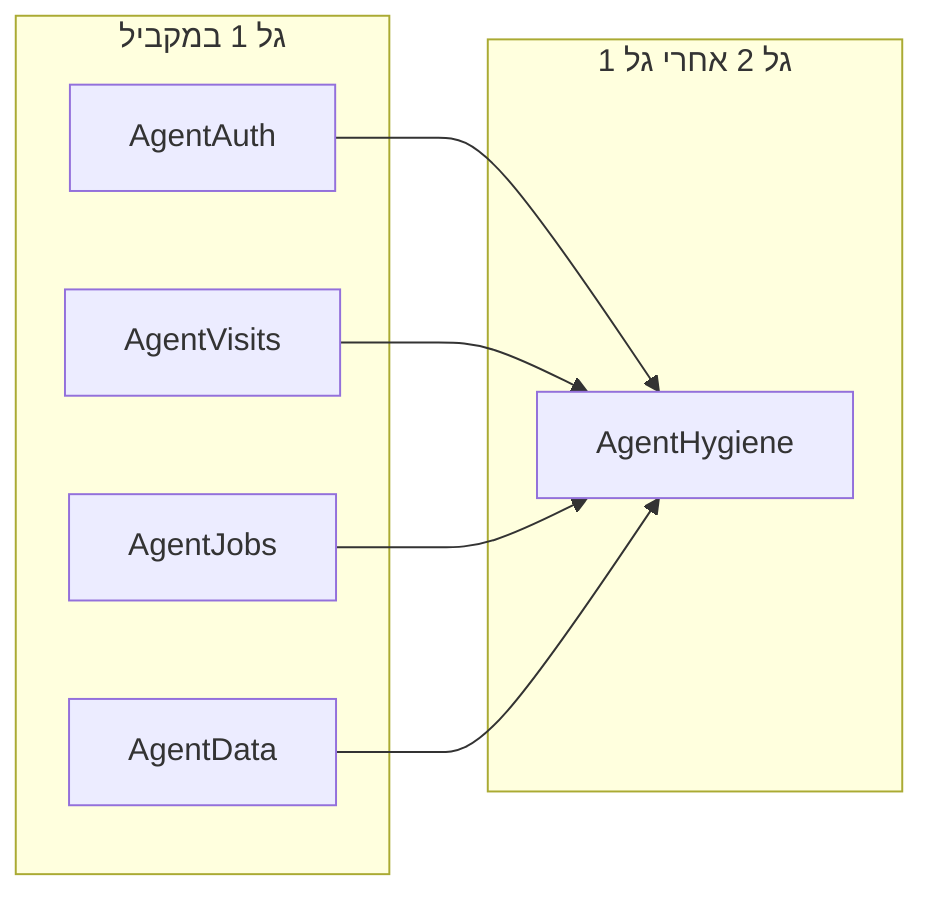

# תיקון כל מה שנשאר מהביקורת

תוכנית מאושרת (2026-09-19). ביצוע בסוכנים מקבילים על ענפים `cursor/<name>-0667`.

## מה כבר סגור (לא לגעת)

מ-[PR #19](https://github.com/ido318/mvp-noa-1-0/pull/19) ומ-`main`: Next.js 16.3.5, סכמת `call_reviews`, חיובים/FK חשבונית, קישור תשלום אידמפוטנטי, חלון 14 יום + שעות ב-book/reschedule, תזמון תזכורות חיסון, מסמכי Twilio native inbound, טריגר SMS מקודד (הוחלף ב-PR של תבניות מהדשבורד).

**מחוץ לקוד בריפו:** דיפלוי Fly לסוכן, וידוא Vercel, חולשת `qs` דרך Twilio. לא סוכני קוד — צעד תפעולי אחרי המיזוגים.

## עקרונות אחרי אישור

- בסיס: `origin/main` (אחרי #19).
- כל סוכן: ענף `cursor/<name>-0667`, קומיטים באנגלית, PR נפרד, טסטים על מה שנגע.
- עברית מול המשתמש; לא לשנות תבניות SMS קפואות / דגלים אדומים בלי צורך.
- אחרי שהסוכנים חוזרים: לבדוק חפיפות, להריץ `npm run typecheck:all` + `npm run test:all`, ולעדכן PRs.

גל 2 רץ אחרי גל 1 רק אם צריך למזג `main` קודם; אם אין חפיפה אפשר להריץ גם את E במקביל (קבצים שונים).

---

## סוכן A — אבטחת דשבורד (`cursor/fix-auth-headers-0667`)

**קבצים:** `app/app/login/page.tsx`, `app/app/login/login-form.tsx`, `app/proxy.ts`, `app/lib/api/response.ts`, `app/next.config.ts`, auth-confirm אם קיים.

| ממצא | תיקון |
|---|---|
| H1 | `safeNextPath()`: רק נתיב שמתחיל ב-`/` ולא ב-`//`; ברירת מחדל `/dashboard`. שימוש בלוגין וב-auth confirm. |
| M4 | `jsonError` לא מחזיר `error.details` גולמי ללקוח ב-`EXTERNAL_PROVIDER_ERROR`; לוג בשרת עם `requestId`. |
| M17 | `headers()` ב-Next: `X-Frame-Options`, `Referrer-Policy`, `X-Content-Type-Options`, CSP שמרני שמתיר Supabase / Vercel / Twilio / Green Invoice / OpenAI לפי מה שבשימוש. |

טסטים: יחידה ל-`safeNextPath` + נתיבי `next` זדוניים.

---

## סוכן B — יומן וביקורים (`cursor/fix-visits-calendar-0667`)

**קבצים:** `app/lib/services/appointment.service.ts`, `app/lib/repositories/visit.repository.ts`, `app/lib/repositories/appointment.repository.ts`, `app/lib/services/calendar.service.ts`, `app/lib/services/dashboard-notifications.service.ts`, מיגרציה חדשה, `agent/src/lib/notifications.ts` רק כהפניה ל-`arrival_reminder`.

| ממצא | תיקון |
|---|---|
| H4 | אינדקס ייחודי חלקי על `visits(appointment_id)` WHERE `appointment_id IS NOT NULL AND deleted_at IS NULL`. RPC/טרנזקציה: יצירת ביקור + עדכון תור ל-`in_visit`. |
| H6 | ב-`availabilityByDate` לכלול `checked_in` ו-`in_visit` כמו `agent/src/lib/store.ts` וה-exclusion ב-DB. |
| M2 | באישור `pending_approval` להוסיף `arrival_reminder` (שעתיים לפני), כמו הסוכן. |
| M3 | למפות `23P01` / `appointments_no_active_overlap` ל-`AppError.conflict` ב-appointment repository. |

---

## סוכן C — סוכן קולי ו-jobs (`cursor/fix-agent-jobs-0667`)

**קבצים:** `agent/src/server/routes/jobs.ts`, `agent/src/lib/notificationProcessor.ts`, `agent/src/lib/vaccinationReminders.ts`, `agent/src/server/routes/vaccinationReminders.ts`, `supabase/scripts/cron-jobs.sql`, `agent/src/lib/store.ts` (`saveVoiceCall`), `agent/src/server/routes/tools.ts`.

| ממצא | תיקון |
|---|---|
| H10 | ברירת מחדל `AGENT_CLINIC_ID` ב-jobs; `.eq("clinic_id")` במעבד SMS ובסריקת חיסונים; גוף cron עם clinic id. |
| M12 | `extractCallerPhone()` כמו SID (top-level / metadata / dynamic_variables). |
| M13 | שגיאות ולידציה/עסק ל-tools: HTTP 200 + `{ result }`; 403 לאימות; 5xx רק כשתלות באמת נפלה. |
| M14 | באצ' מוגבל במעבד SMS + לולאה/לוג של נותר. |
| M15 | אותו wrapper של rate-limit/idempotency כמו שאר `/jobs`. |

---

## סוכן D — נתונים, מלאי, סקריפטים, אחסון (`cursor/fix-data-integrity-0667`)

**קבצים:** `app/scripts/reset-clinic-data.mjs`, `app/lib/repositories/customer.repository.ts`, `app/lib/repositories/pet.repository.ts`, `app/lib/repositories/inventory.repository.ts`, מיגרציות storage + inventory FK, `supabase/config.toml`.

| ממצא | תיקון |
|---|---|
| H7 | חובה `CLINIC_ID` + אישור project-ref; מחיקה רק לפי `clinic_id`; סירוב לטבלאות בלי scope. |
| H11 | יצירת באקטים `call-recordings` / `soap-recordings` באופן אידמפוטנטי (מיגרציה או `config.toml` + הערה ב-checklist). |
| M5 | לברוח תווי PostgREST (`% _ , ( )`) או RPC עם פרמטרים. |
| M6 | RPC אטומי: עדכון מלאי + שורת טרנזקציה באותה פעולה, עם בדיקת `quantity >= 0`. |
| M7 | FK מורכב `(item_id, clinic_id)` ל-`inventory_transactions` (תשלומים/חיובים כבר תוקנו). |

---

## סוכן E — היגיינה, AI, תיעוד (`cursor/fix-hygiene-docs-0667`)

**קבצים:** `app/lib/services/ai-artifact.service.ts`, `app/vitest.config.ts`, שירותי מחיר/appointments כפילות, `README.md`, `AGENTS.md`, `CLAUDE.md`, `package.json`, `app/lib/learning/elevenlabsTesting.ts`, `app/lib/repositories/visit-share.repository.ts`.

| ממצא | תיקון |
|---|---|
| M8 | מקור אחד למשכי ביקור / תוויות / מחירי SMS ב-`@tomer/shared` או ייבוא משותף; לא לשבור מחירון הדשבורד. |
| M9 | להתקין/לתעד Supabase CLI ב-`.cursor/environment.json` אם קיים, או סקריפט ברור שנכשל עם הודעה. |
| M10 | לנקות 4 אזהרות lint; לשקול `max-warnings=0` בלינט של app. |
| M11 | `import.meta.dirname` ב-vitest config. |
| M16 | בלי stub שקט ב-prod: 503 כשאין OpenAI (כמו visit summary), או פיצ'ר מוסתר. |
| L1–L5, L8, L9 | ליישר README/AGENTS/CLAUDE; `lint:all`/`build:all`; באנר על דוחות ישנים; להעביר ארכיון או לינק; לתקן לינק `VOXLY_SOURCE_OF_TRUTH`; להסיר guard כפול ב-elevenlabsTesting. |
| L6 | לא למחוק בראנצ'ים מרחוק בלי רשימה לאישור — רק לתעד ב-PR מה מועמד למחיקה. |
| L7 | `view_count = view_count + 1` ב-SQL/RPC. |
| L4 | לחבר או למחוק helpers מתים אחרי ש-B סיים את נתיב ה-SMS. |

---

## סדר הרצה אחרי אישור

1. ארבעה Task agents במקביל: A, B, C, D — כל אחד עם רשימת ממצאים, קבצים, קריטריון הצלחה, ואיסור לגעת בקבצי סוכן אחר.
2. סוכן E במקביל אם אין נגיעה ב-`app/lib/services/dashboard-notifications.service.ts` / appointments (L4 מחכה ל-B אם צריך).
3. סוכן האב: לקרוא תוצרים, לפתור קונפליקטים מול `main`, להריץ typecheck+tests, לפתוח/לעדכן PRs.

## סיכון

- מיגרציות (H4, H11, M6, M7) דורשות הרצה בענן אחרי מיזוג, כמו בפעם הקודמת.
- CSP עלול לשבור טעינת סקריפטים — לבדוק דשבורד אחרי A.
- M8 (מחירים משותפים) הוא הרגיש ביותר ל-SMS — לא לשנות ניסוח תבניות, רק מקור המספרים/משכים.
